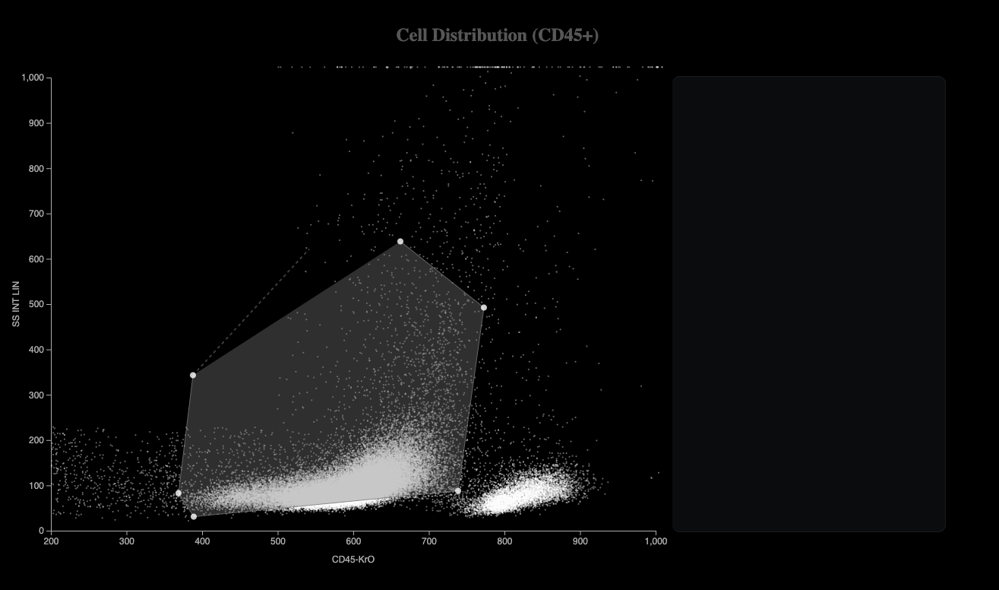
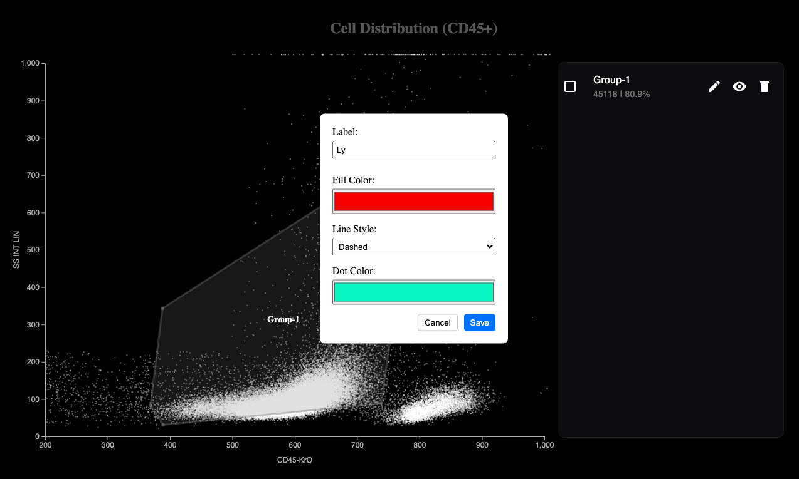
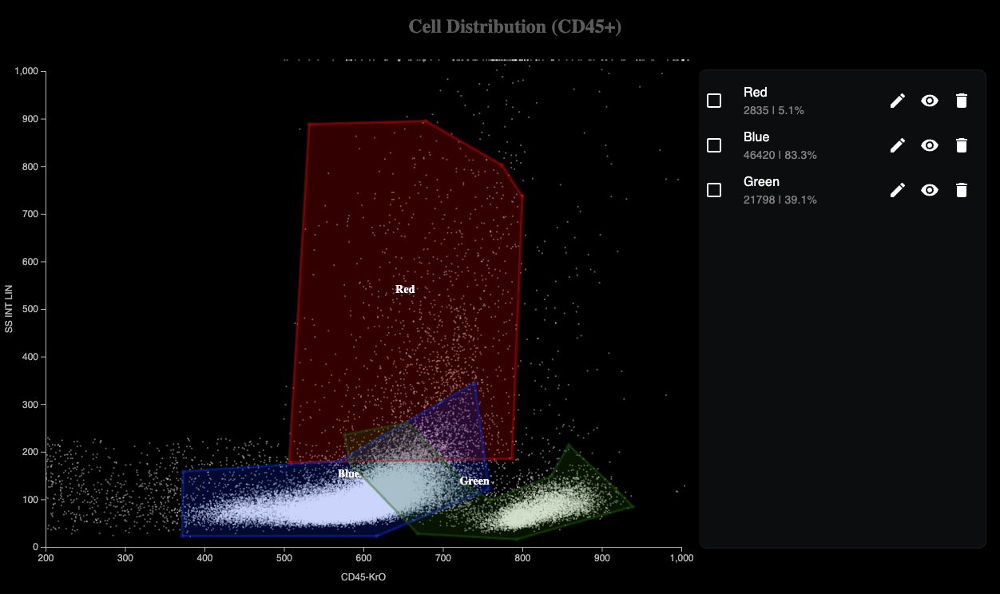

This is a  Data Visualization project for the 2025 Data Visualization Challenge. The project is a web application that allows users to visualize data on a Chart. The project is built using D3.js, React, Next.js, Tailwind CSS, TypeScript, Context API, React Hooks, and React Context. 


## Getting Started

First, run the development server:

```bash
yarn
yarn dev
```

Open [http://localhost:3000](http://localhost:3000) with your browser to see the result .


## Examples
- Arbitrary Polygon Creation and Selection
  

- Polygon: Supporting Edition, Disable, Enable, Delete
  

- Data: Summation of "AND", "OR" Condition
  

## Features
- Polygon
  - Creation of Arbitrary Polygon
  - Edition of Polygon
    - Color of Polygon Brush
    - Color of Polygon Border
    - Color of Polygon Text
    - Color of Data Dot inside Polygon
    - Style for Border of Polygon
    - Disable or Enable Polygon
    - Delete Polygon
- Data 
  - Summation of Data inside Polygon : "Amount" & "Percentage"
  - Summation of "AND", "OR" Condition

- List of Data
  - Polygon Selection : Mutual Binding on List Item and Polygon

## Techniques
- D3.js
- React
- motion-library
- Next.js 
- Tailwind CSS
- TypeScript
- Context API
- React Hooks
- React Context


