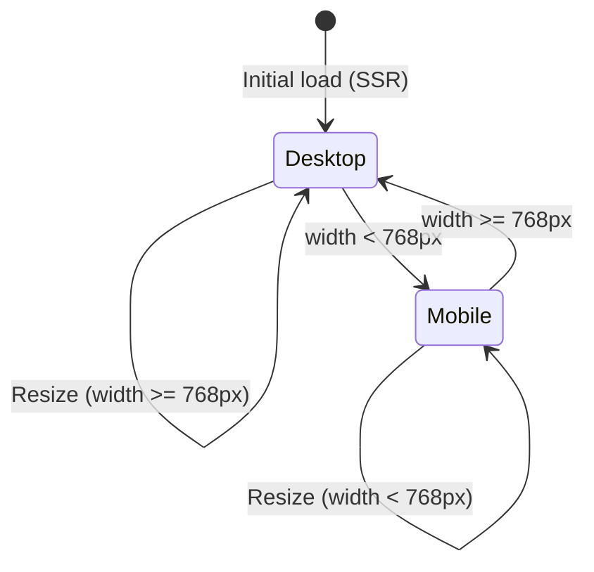
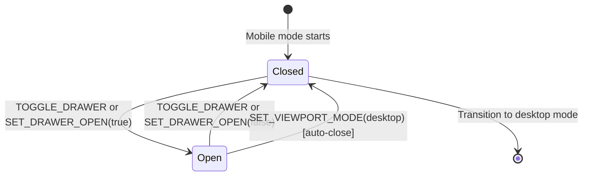

# Data Model: Responsive Layout with Mobile Drawer

**Feature**: 001-responsive-layout
**Date**: 2025-12-04
**Status**: Complete

## Overview

This document defines the data model extensions to support responsive layout functionality. All state additions follow the Context-Based State Management principle (Constitution Principle III).

---

## Context State Extensions

### ChartContext State Additions

```typescript
// src/contexts/ChartContext.tsx

// Existing ChartState interface - ADDITIONS ONLY
type ChartState = {
  // ... existing state fields (data, polygons, currentPoints, etc.)

  // NEW: Drawer state
  isDrawerOpen: boolean;

  // NEW: Viewport state
  viewportMode: 'mobile' | 'desktop';
  viewportWidth: number;
  viewportHeight: number; // Added for potential future use (chart aspect ratio calculations)
}
```

### Initial State

```typescript
const initialState: ChartState = {
  // ... existing initial state

  // Drawer defaults
  isDrawerOpen: false,

  // Viewport defaults (will be overridden on mount)
  viewportMode: 'desktop', // Default to desktop for SSR
  viewportWidth: 0,
  viewportHeight: 0,
}
```

### Rationale for Defaults

- `isDrawerOpen: false` - Drawer starts closed on mobile to maximize chart visibility (per User Story 2)
- `viewportMode: 'desktop'` - SSR-safe default (assumes desktop, then updates client-side)
- `viewportWidth/Height: 0` - Prevents flash of incorrect layout before useViewport hook runs

---

## Action Types

### New Actions

```typescript
// src/contexts/ChartContext.tsx

type ChartAction =
  // ... existing actions (ADD_POINT, COMPLETE_POLYGON, etc.)

  // Drawer actions
  | { type: 'TOGGLE_DRAWER' }
  | { type: 'SET_DRAWER_OPEN'; payload: boolean }

  // Viewport actions
  | { type: 'SET_VIEWPORT_MODE'; payload: { mode: 'mobile' | 'desktop'; width: number; height?: number } }
  | { type: 'SET_VIEWPORT_DIMENSIONS'; payload: { width: number; height: number } }
```

### Action Descriptions

| Action | Payload | Purpose | Dispatch Location |
|--------|---------|---------|-------------------|
| `TOGGLE_DRAWER` | None | Toggles drawer open/close state | DrawerToggleFab component |
| `SET_DRAWER_OPEN` | `boolean` | Explicitly sets drawer state | MobileDrawer onClose callback |
| `SET_VIEWPORT_MODE` | `{ mode, width, height? }` | Updates viewport mode when breakpoint crosses | useViewport hook (page.tsx) |
| `SET_VIEWPORT_DIMENSIONS` | `{ width, height }` | Updates dimensions without mode change | Resize listener (if mode unchanged) |

---

## Reducer Logic

### TOGGLE_DRAWER

```typescript
case 'TOGGLE_DRAWER':
  return {
    ...state,
    isDrawerOpen: !state.isDrawerOpen,
  };
```

**Validation**: None needed (boolean toggle is always valid)

### SET_DRAWER_OPEN

```typescript
case 'SET_DRAWER_OPEN':
  return {
    ...state,
    isDrawerOpen: action.payload,
  };
```

**Use Case**: Programmatic control (e.g., close drawer on backdrop click)

### SET_VIEWPORT_MODE

```typescript
case 'SET_VIEWPORT_MODE':
  const { mode, width, height } = action.payload;

  // Auto-close drawer when transitioning from mobile to desktop
  const shouldCloseDrawer = mode === 'desktop' && state.viewportMode === 'mobile' && state.isDrawerOpen;

  return {
    ...state,
    viewportMode: mode,
    viewportWidth: width,
    viewportHeight: height ?? state.viewportHeight, // Preserve existing height if not provided
    isDrawerOpen: shouldCloseDrawer ? false : state.isDrawerOpen,
  };
```

**Key Logic**:
1. Updates viewport mode and dimensions
2. **Auto-closes drawer** when transitioning from mobile to desktop (per Clarification answer 4)
3. Preserves drawer state on desktop→mobile transition (drawer starts closed on mobile per FR-003)

### SET_VIEWPORT_DIMENSIONS

```typescript
case 'SET_VIEWPORT_DIMENSIONS':
  return {
    ...state,
    viewportWidth: action.payload.width,
    viewportHeight: action.payload.height,
  };
```

**Use Case**: Update dimensions without rechecking breakpoint (micro-optimization for resize events that don't cross 768px threshold)

---

## State Transitions

### Viewport Mode Transitions



### Drawer State Transitions (Mobile Only)



---

## Entity Relationships

### Viewport State Entity

**Purpose**: Represents current screen dimensions and responsive breakpoint status

**Fields**:
- `mode: 'mobile' | 'desktop'` - Current responsive mode based on 768px breakpoint
- `width: number` - Current window width in pixels
- `height: number` - Current window height in pixels

**Relationships**:
- **Determines** → Sidebar visibility (hidden on mobile, visible on desktop)
- **Determines** → Drawer availability (only on mobile)
- **Determines** → FAB visibility (only on mobile)
- **Triggers** → Chart resize recalculations

**Lifecycle**: Updated on window resize events (debounced 150ms)

### Drawer State Entity

**Purpose**: Represents whether mobile drawer is open or closed

**Fields**:
- `isOpen: boolean` - Drawer open/close state

**Relationships**:
- **Depends on** → Viewport mode (only exists in mobile mode)
- **Controls** → Body scroll lock (locked when open per FR-014)
- **Contains** → Sidebar component (reused in drawer)

**Lifecycle**:
- Created when viewport mode changes to mobile
- Destroyed when viewport mode changes to desktop
- Toggled by FAB clicks or backdrop clicks while in mobile mode

**Constraints**:
- Can only be `true` when `viewportMode === 'mobile'`
- Automatically set to `false` on mobile→desktop transition

---

## Layout Configuration Entity

**Purpose**: Defines responsive layout settings and breakpoint thresholds

**Structure** (Constants, not in state):

```typescript
// src/constants/layout.ts

export const LAYOUT_CONFIG = {
  // Breakpoints
  MOBILE_BREAKPOINT: 768, // pixels (from spec)

  // Drawer settings
  DRAWER_HEIGHT_VH: 65, // 65vh (60-70% range from clarifications)
  DRAWER_BORDER_RADIUS: 16, // pixels (top corners for bottom sheet appearance)

  // FAB settings
  FAB_POSITION: {
    bottom: 16, // pixels from bottom edge
    right: 16,  // pixels from right edge
  },

  // Debouncing
  RESIZE_DEBOUNCE_MS: 150, // from clarifications

  // Chart margins (existing, for reference)
  CHART_MARGINS: {
    top: 20,
    right: 20,
    bottom: 50,
    left: 60,
  },
} as const;
```

**Rationale**: Centralized configuration prevents magic numbers scattered across components

---

## Chart Dimensions Entity

**Purpose**: Represents calculated canvas dimensions based on available space

**Fields** (not in context state - calculated in Chart component):
- `containerWidth: number` - Chart container width in pixels
- `containerHeight: number` - Chart container height in pixels
- `canvasWidth: number` - Canvas element width (containerWidth × devicePixelRatio)
- `canvasHeight: number` - Canvas element height (containerHeight × devicePixelRatio)

**Calculation Logic**:

```typescript
// Chart.tsx
const chartContainerRef = useRef<HTMLDivElement>(null);
const { viewportWidth, viewportMode } = useChart();

useEffect(() => {
  const container = chartContainerRef.current;
  if (!container) return;

  // Container dimensions from DOM
  const containerWidth = container.clientWidth;
  const containerHeight = container.clientHeight;

  // Canvas dimensions scaled for HiDPI
  const dpr = window.devicePixelRatio || 1;
  const canvasWidth = containerWidth * dpr;
  const canvasHeight = containerHeight * dpr;

  // Update canvas elements
  // ... (see research.md Question 4)
}, [viewportWidth]); // Recalculate when viewport changes
```

**Dependencies**:
- Container size (affected by sidebar/drawer visibility)
- Viewport mode (determines layout)
- devicePixelRatio (for HiDPI scaling)

---

## Validation Rules

### Viewport Mode

```typescript
// Validation function
function isValidViewportMode(mode: unknown): mode is 'mobile' | 'desktop' {
  return mode === 'mobile' || mode === 'desktop';
}
```

**Constraint**: Must be exactly 'mobile' or 'desktop' (no other values)

### Viewport Dimensions

```typescript
// Validation function
function isValidViewportDimensions(width: number, height: number): boolean {
  return (
    width >= 320 && // Minimum viable viewport (from SC-008)
    width <= 2560 && // Maximum supported viewport (from SC-008)
    height > 0 &&
    Number.isFinite(width) &&
    Number.isFinite(height)
  );
}
```

**Constraints**:
- Width: 320px - 2560px (per SC-008)
- Height: > 0 (any positive height valid)
- Both must be finite numbers

### Drawer State

```typescript
// Validation function
function isValidDrawerState(isOpen: boolean, viewportMode: 'mobile' | 'desktop'): boolean {
  // Drawer can only be open in mobile mode
  if (isOpen && viewportMode !== 'mobile') {
    console.warn('Drawer cannot be open in desktop mode');
    return false;
  }
  return true;
}
```

**Constraint**: `isDrawerOpen` can only be `true` when `viewportMode === 'mobile'`

---

## State Persistence

**Decision**: No persistence needed

**Rationale**:
- Drawer state is ephemeral (resets to closed on page load per FR-003)
- Viewport mode/dimensions auto-detected on mount
- User preference for drawer state not required (always starts closed for optimal chart visibility)

**Exception**: If future requirement adds "remember drawer state", use `localStorage`:
```typescript
localStorage.setItem('drawerPreference', 'open' | 'closed');
```

---

## Migration Strategy

### Existing State Compatibility

**No breaking changes** - Only additive modifications to ChartState.

**Existing code continues to work** because:
- New fields have default values in `initialState`
- No existing reducers modified (only new actions added)
- Existing components don't reference new fields (optional consumption)

### Type Safety

TypeScript strict mode ensures:
1. New state fields must be initialized
2. New action types must be handled in reducer
3. Components using new state must type-check payload shapes

---

## Performance Considerations

### State Update Frequency

| State Field | Update Frequency | Performance Impact |
|-------------|------------------|-------------------|
| `isDrawerOpen` | Low (~1-2 times per session) | Negligible |
| `viewportMode` | Very Low (only on breakpoint cross) | Negligible |
| `viewportWidth/Height` | Medium (debounced to ~6-7 events/sec max) | Low (dimensions are numbers, cheap to update) |

### Re-render Optimization

**Pattern**: Components subscribe to only the context fields they need

```typescript
// Good: Only subscribes to drawer state
function DrawerToggleFab() {
  const { isDrawerOpen, viewportMode } = useChart();
  // ... component doesn't re-render when data or polygons change
}

// Avoid: Subscribes to entire context
function DrawerToggleFab() {
  const state = useChart(); // Re-renders on ANY state change
}
```

**Memo Candidates**: None needed (viewport state updates are intentional re-render triggers for layout changes)

---

## Testing Considerations

### Contract Tests (if testing requested)

1. **Viewport Mode Transition**:
   - `width < 768` → `viewportMode === 'mobile'`
   - `width >= 768` → `viewportMode === 'desktop'`

2. **Auto-close Drawer on Desktop Transition**:
   - Given: `viewportMode === 'mobile'`, `isDrawerOpen === true`
   - When: `SET_VIEWPORT_MODE({ mode: 'desktop', ... })`
   - Then: `isDrawerOpen === false`

3. **Drawer State Constraint**:
   - Given: `viewportMode === 'desktop'`
   - When: `TOGGLE_DRAWER`
   - Then: `isDrawerOpen` remains `false` (or warn/no-op)

### Integration Test Scenarios

1. **Mobile Load → Open Drawer → Close Drawer**
2. **Desktop Load → Resize to Mobile → Open Drawer → Resize to Desktop** (verify auto-close)
3. **Rapid Resize Events** (verify debouncing prevents excessive updates)

---

## Summary

### State Additions

- `isDrawerOpen: boolean` - Drawer visibility
- `viewportMode: 'mobile' | 'desktop'` - Responsive mode
- `viewportWidth: number` - Window width
- `viewportHeight: number` - Window height

### Actions

- `TOGGLE_DRAWER` - Toggle drawer state
- `SET_DRAWER_OPEN` - Set drawer state explicitly
- `SET_VIEWPORT_MODE` - Update viewport mode and dimensions
- `SET_VIEWPORT_DIMENSIONS` - Update dimensions only

### Key Relationships

- Viewport mode determines sidebar vs drawer layout
- Drawer state depends on viewport mode (mobile only)
- Chart dimensions recalculate on viewport changes
- Auto-close drawer on mobile→desktop transition

### Validation Rules

- Viewport mode: 'mobile' | 'desktop' only
- Viewport width: 320px - 2560px
- Drawer open: Only when viewportMode === 'mobile'

---

## Next Steps

Generate TypeScript contracts in `contracts/` directory with concrete interface definitions.
