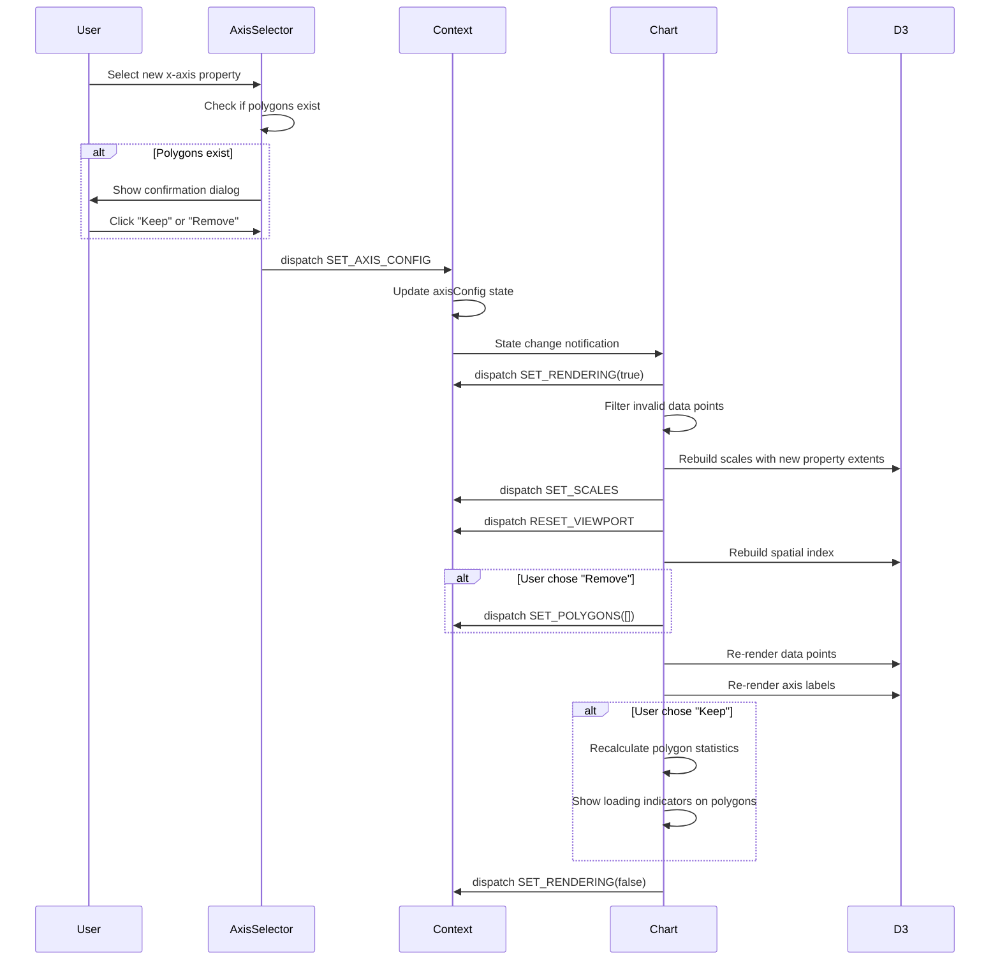

# Data Model: Dynamic Axis Selection

**Feature**: 005-dynamic-axis | **Date**: 2025-12-03  
**Purpose**: Define type-safe entities and state structures

---

## Core Entities

### 1. GlobalState (New)

Represents global application state accessible to all components.

**TypeScript Definition**:
```typescript
interface GlobalState {
  // Global loading state (for data operations, axis changes, etc.)
  isLoading: boolean;
  
  // Optional message to display during loading
  loadingMessage?: string;
}
```

**Default Values**:
```typescript
const INITIAL_GLOBAL_STATE: GlobalState = {
  isLoading: false,
  loadingMessage: undefined,
};
```

**Purpose**: Centralize global concerns (loading state) separate from feature-specific state (ChartContext)

**Relationships**:
- Consumed by Loading component to show/hide plant circles animation
- Updated by any component that triggers long-running operations
- Wraps entire app via GlobalContext provider in layout.tsx

---

### 2. AxisConfiguration

Represents the current x and y axis selections with measurement unit scaling.

**TypeScript Definition**:
```typescript
interface AxisConfiguration {
  // Selected property names (must match CSV column names)
  xProperty: DataPropertyName;
  yProperty: DataPropertyName;
  
  // Display labels for axes (derived from property names)
  xLabel: string;
  yLabel: string;
  
  // Measurement units (extracted from property name suffixes)
  xUnit: string;  // May be empty string if dimensionless
  yUnit: string;  // May be empty string if dimensionless
  
  // Measurement unit scaling factor (100-2000, default 1000)
  unitScale: number;
}
```

**Default Values**:
```typescript
const DEFAULT_AXIS_CONFIG: AxisConfiguration = {
  xProperty: 'CD45-KrO',
  yProperty: 'SS INT LIN',
  xLabel: 'CD45-KrO',
  yLabel: 'SS INT LIN',
  xUnit: 'KrO',
  yUnit: 'INT LIN',
  unitScale: 1000,
};
```

**Validation Rules**:
- `xProperty !== yProperty` (enforced by dropdown option filtering)
- `xProperty` and `yProperty` must exist in `DataPropertyName` enum
- `unitScale` must be in range [100, 2000]
- Labels derived automatically via `parsePropertyLabel()` utility

**Relationships**:
- Used by ChartContext to store current axis state
- Consumed by Chart component to rebuild D3 scales
- Consumed by AxisSelector component for dropdown values

---

### 2. DataPropertyName (Enum)

String literal union type of all available numeric data properties from CSV.

**TypeScript Definition**:
```typescript
// Available data properties from CD45_pos.csv (in CSV order)
type DataPropertyName = 
  | 'FS INT LIN'
  | 'SS INT LIN'
  | 'Kappa-FITC'
  | 'Lambda-PE'
  | 'CD10-ECD'
  | 'CD5-PC5.5'
  | 'CD200-PC7'
  | 'CD34-APC'
  | 'CD38-APC-A700'
  | 'CD20-APC-A750'
  | 'CD19-PB'
  | 'CD45-KrO'
  | 'TIME'
  | 'FS PEAK LIN'
  | 'SS PEAK LIN';

// Array version for iteration (maintains CSV order)
const DATA_PROPERTY_NAMES: readonly DataPropertyName[] = [
  'FS INT LIN',
  'SS INT LIN',
  'Kappa-FITC',
  'Lambda-PE',
  'CD10-ECD',
  'CD5-PC5.5',
  'CD200-PC7',
  'CD34-APC',
  'CD38-APC-A700',
  'CD20-APC-A750',
  'CD19-PB',
  'CD45-KrO',
  'TIME',
  'FS PEAK LIN',
  'SS PEAK LIN',
] as const;
```

**Purpose**: Type-safe reference for all selectable axis properties

**Usage**:
- Validate axis property names at compile time
- Generate dropdown options in AxisSelector component
- Type-guard for CSV data access: `data[property]` is type-safe

---

### 3. DataPropertyMetadata

Extended information about each data property for UI display.

**TypeScript Definition**:
```typescript
interface DataPropertyMetadata {
  // Property name (matches CSV column, must be DataPropertyName)
  propertyName: DataPropertyName;
  
  // Human-readable label for UI (e.g., "CD45" from "CD45-KrO")
  displayLabel: string;
  
  // Measurement unit (e.g., "KrO", "INT LIN", empty for dimensionless)
  unit: string;
  
  // Data type (always numeric for this dataset)
  dataType: 'numeric';
}
```

**Generation**:
```typescript
const generatePropertyMetadata = (propertyName: DataPropertyName): DataPropertyMetadata => {
  const { marker, unit } = parsePropertyLabel(propertyName);
  
  return {
    propertyName,
    displayLabel: marker,
    unit,
    dataType: 'numeric',
  };
};

// Precomputed metadata for all properties
const PROPERTY_METADATA: Record<DataPropertyName, DataPropertyMetadata> = 
  Object.fromEntries(
    DATA_PROPERTY_NAMES.map(name => [name, generatePropertyMetadata(name)])
  ) as Record<DataPropertyName, DataPropertyMetadata>;
```

**Purpose**: Centralize property metadata for consistent UI display across components

**Usage**:
- Display property labels in dropdown options
- Show units in axis labels
- Future: Extend with value ranges, descriptions, etc.

---

### 4. CellData (Extended)

Existing entity representing a single data point. **No structural changes**, but access patterns change.

**Current Definition** (from `loadCsvData.ts`):
```typescript
export interface CellData {
  x: number;  // Currently hardcoded to CD45-KrO
  y: number;  // Currently hardcoded to SS INT LIN
  // All CSV columns as indexed properties
  [key: string]: number;
}
```

**Updated Access Pattern**:
```typescript
// Old (hardcoded axes)
const xValue = dataPoint.x;
const yValue = dataPoint.y;

// New (dynamic axes)
const xValue = dataPoint[axisConfig.xProperty];
const yValue = dataPoint[axisConfig.yProperty];
```

**Validation Enhancement**:
```typescript
// Filter invalid data points for selected axes
const isValidDataPoint = (d: CellData, xProp: DataPropertyName, yProp: DataPropertyName): boolean => {
  const xValue = d[xProp];
  const yValue = d[yProp];
  
  return (
    xValue != null &&
    yValue != null &&
    !isNaN(xValue) &&
    !isNaN(yValue) &&
    isFinite(xValue) &&
    isFinite(yValue)
  );
};
```

**Backward Compatibility**: Keep `x` and `y` properties populated for existing code, but migrate to dynamic access pattern.

---

## State Management

### ChartContext State Extension

**Current ChartState** (from `ChartContext.tsx`):
```typescript
interface ChartState {
  data: CellData[];
  polygons: Polygon[];
  currentPoints: Point[];
  selectedPolygonId: string[];
  isDrawing: boolean;
  showPopup: ShowPopup;
  loading: boolean;
  checkedPolygons: string[];
  scales: {
    xScale: d3.ScaleLinear<number, number>;
    yScale: d3.ScaleLinear<number, number>;
  } | null;
  // ... canvas-specific state
}
```

**Add AxisConfiguration**:
```typescript
interface ChartState {
  // ... existing fields
  
  // NEW: Axis configuration state
  axisConfig: AxisConfiguration;
  
  // NEW: UI state for dropdown disable during render
  isRendering: boolean;
}
```

**New Actions**:
```typescript
type ChartAction =
  | { type: 'SET_AXIS_CONFIG'; config: Partial<AxisConfiguration> }
  | { type: 'SET_RENDERING'; isRendering: boolean }
  | { type: 'RESET_VIEWPORT' }  // Reset zoom/pan when axes change
  // ... existing actions
```

**Reducer Logic**:
```typescript
case 'SET_AXIS_CONFIG':
  return {
    ...state,
    axisConfig: {
      ...state.axisConfig,
      ...action.config,
    },
    // Invalidate scales (will be rebuilt by Chart component)
    scales: null,
  };

case 'SET_RENDERING':
  return { ...state, isRendering: action.isRendering };

case 'RESET_VIEWPORT':
  return {
    ...state,
    viewport: {
      translateX: 0,
      translateY: 0,
      scale: 1,
    },
  };
```

---

## Data Flow

### Axis Change Sequence



---

## Validation Rules

### Runtime Validation

**1. Axis Property Validation**
```typescript
const isValidAxisProperty = (prop: string): prop is DataPropertyName => {
  return DATA_PROPERTY_NAMES.includes(prop as DataPropertyName);
};
```

**2. Axis Configuration Validation**
```typescript
const validateAxisConfig = (config: AxisConfiguration): boolean => {
  return (
    isValidAxisProperty(config.xProperty) &&
    isValidAxisProperty(config.yProperty) &&
    config.xProperty !== config.yProperty &&
    config.unitScale >= 100 &&
    config.unitScale <= 2000
  );
};
```

**3. Data Point Validation** (per selected axes)
```typescript
const getValidDataPoints = (
  data: CellData[], 
  xProp: DataPropertyName, 
  yProp: DataPropertyName
): CellData[] => {
  return data.filter(d => isValidDataPoint(d, xProp, yProp));
};
```

---

## Migration Strategy

### Phase 1: Add State (No Breaking Changes)
1. Add `axisConfig` and `isRendering` to ChartState with defaults
2. Add new actions to ChartAction union
3. Existing code continues to use `data.x` and `data.y`

### Phase 2: Migrate Chart Component
1. Update Chart to consume `axisConfig` instead of hardcoded properties
2. Update scale creation to use `axisConfig.xProperty` and `axisConfig.yProperty`
3. Add axis change handler

### Phase 3: Add AxisSelector Component
1. Create AxisSelector with dropdown UI
2. Connect to Context via dispatch
3. Add to Sidebar

### Phase 4: Deprecate Hardcoded Axes (Future)
1. Remove `x` and `y` from CellData interface
2. Update all data access to use dynamic properties
3. Update CSV loader to not populate `x` and `y`

---

## Type Exports

**File**: `src/types/state.d.ts`
```typescript
export interface AxisConfiguration {
  xProperty: DataPropertyName;
  yProperty: DataPropertyName;
  xLabel: string;
  yLabel: string;
  xUnit: string;
  yUnit: string;
  unitScale: number;
}

export type DataPropertyName = 
  | 'FS INT LIN'
  | 'SS INT LIN'
  // ... (all 15 properties)

export interface DataPropertyMetadata {
  propertyName: DataPropertyName;
  displayLabel: string;
  unit: string;
  dataType: 'numeric';
}
```

**File**: `src/utils/constants/axis.ts`
```typescript
export const DATA_PROPERTY_NAMES: readonly DataPropertyName[] = [ /* ... */ ];
export const DEFAULT_AXIS_CONFIG: AxisConfiguration = { /* ... */ };
export const PROPERTY_METADATA: Record<DataPropertyName, DataPropertyMetadata> = { /* ... */ };
```
